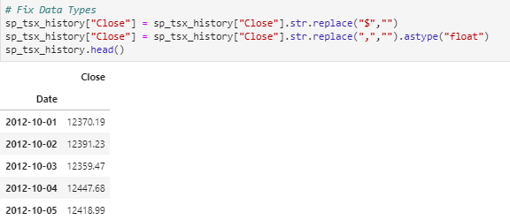
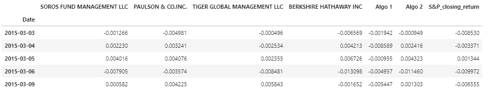
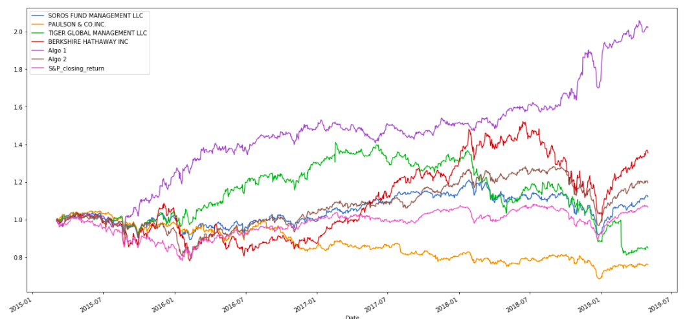
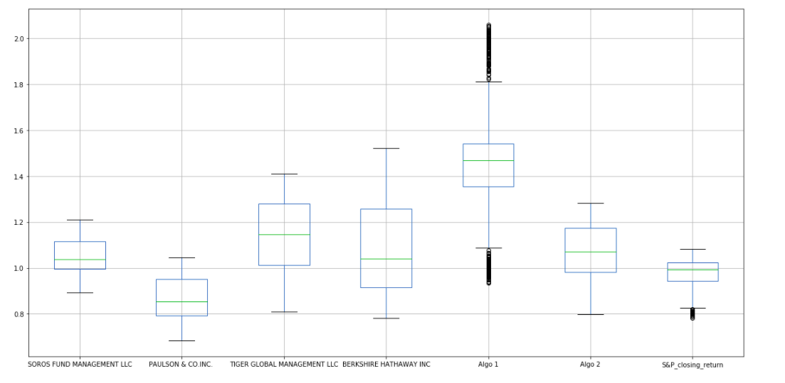
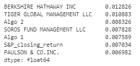
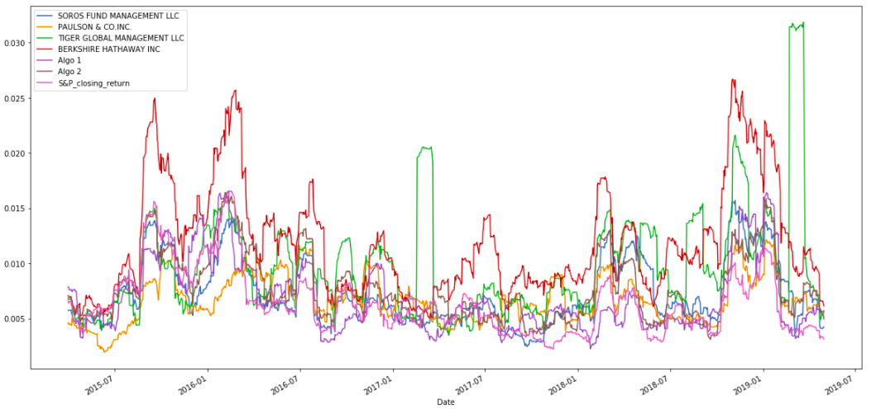
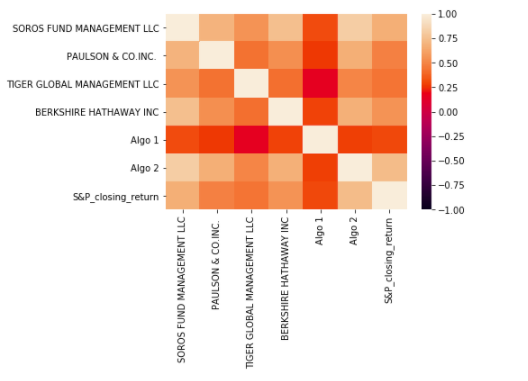
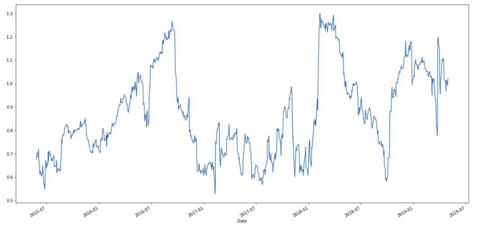
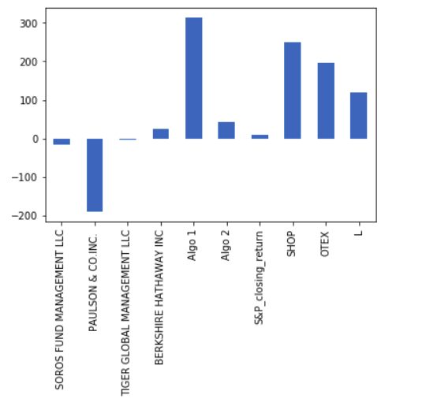

# Whale of the Potfolio

## Background
Harold's company has been investing in algorithmic trading strategies. Some of the investment managers love them, some hate them, but they all think their way is best.
You just learned these quantitative analysis techniques with Python and Pandas, so Harold has come to you with a challenge—to help him determine which portfolio is performing the best across multiple areas: volatility, returns, risk, and Sharpe ratios.
You need to create a tool (an analysis notebook) that analyzes and visualizes the major metrics of the portfolios across all of these areas, and determine which portfolio outperformed the others. You will be given the historical daily returns of several portfolios: some from the firm's algorithmic portfolios, some that represent the portfolios of famous "whale" investors like Warren Buffett, and some from the big hedge and mutual funds. You will then use this analysis to create a custom portfolio of stocks and compare its performance to that of the other portfolios, as well as the larger market (S&P TSX 60 Index).

## Prerequisites
Pandas

Python

Numpy

## Data Preparation
1. Used Pandas to read in each of the CSV files as a DataFrame and converted the dates to a DateTimeIndex

2. Detected and removed Nulls:

3. Identified Data types and adjusted the type as required by removing the Dollar sign:

4. Calculated daily retruns and concatenated Whale Returns, Algorithmic Returns, and the S&P_Closing_returns Returns into a single DataFrame with columns for each portfolio's returns.

## Quantitative Analysis

Calculated and plotted cumulative returns. checked if any portfolio outperform the S&P_Closing_returns.

## Risk Analysis
Created a box plot for each of the returns. To determine which box has the largest spread and Which has the smallest spread.

Calculated the standard deviation for each portfolio. To determine which portfolios are riskier than the S&P_Closing_returns.

## Rolling Statistics
Plotted the rolling standard deviation of the firm's portfolios along with the rolling standard deviation of the S&P_Closing_returns. To determine if the risk increase for each of the portfolios at the same time risk increases in the S&P.

Constructed a correlation matrix for the algorithmic, whale, and S&P_Closing_returns.To determine Which returns most closely mimic the S&P_Closing_returns.

Picked Algo 2 and plotted a rolling beta between that portfolio's returns and S&P_Closing_returns. To determine if the portfolio sensitive to movements in the S&P_Closing_returns.

## Sharp Ratios 

Used the daily returns, calculated and visualized the Sharpe ratios using a bar plot.

## Final Results

Based on the assessment perofrmed above we deduce that, Shopify have the highest Standard devaition which mean it is one of the extremely risky investments. Not only this the heat map also suggests that it is a corelated investment when compared with other investment porfolios.

However as mentioned above, when we observe the performance of Algo1 we have noticed that neither the investment is very risk based in the standard deviation nor is corelated as depicted in the Heatmap above. Further it also has the better sharp ratio than other investments.

Depending on the conclusion drawn above we deduce that ALGO 1 is a better investmnet plan as compared to other sources.
