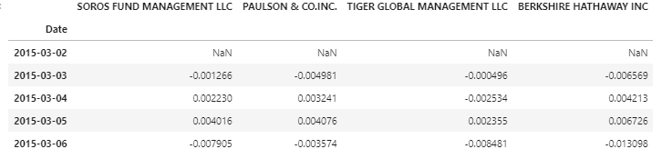
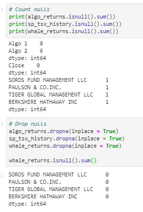

# Whale of the Potfolio

## Background
Harold's company has been investing in algorithmic trading strategies. Some of the investment managers love them, some hate them, but they all think their way is best.
You just learned these quantitative analysis techniques with Python and Pandas, so Harold has come to you with a challenge—to help him determine which portfolio is performing the best across multiple areas: volatility, returns, risk, and Sharpe ratios.
You need to create a tool (an analysis notebook) that analyzes and visualizes the major metrics of the portfolios across all of these areas, and determine which portfolio outperformed the others. You will be given the historical daily returns of several portfolios: some from the firm's algorithmic portfolios, some that represent the portfolios of famous "whale" investors like Warren Buffett, and some from the big hedge and mutual funds. You will then use this analysis to create a custom portfolio of stocks and compare its performance to that of the other portfolios, as well as the larger market (S&P TSX 60 Index).

## Prerequisites
Pandas

Python

Numpy

## Data Preparation
1. Used Pandas to read in each of the CSV files as a DataFrame and converted the dates to a DateTimeIndex

2. Detected and removed Nulls:

